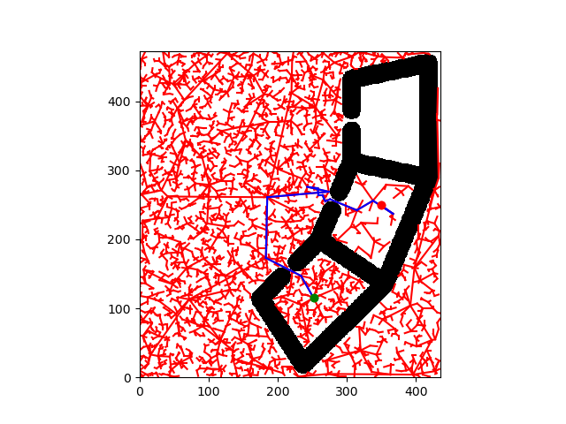
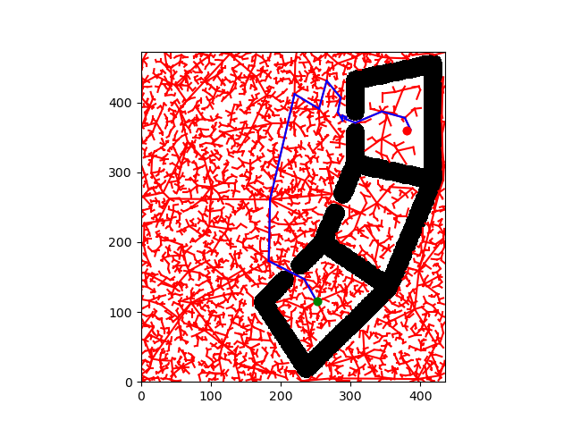
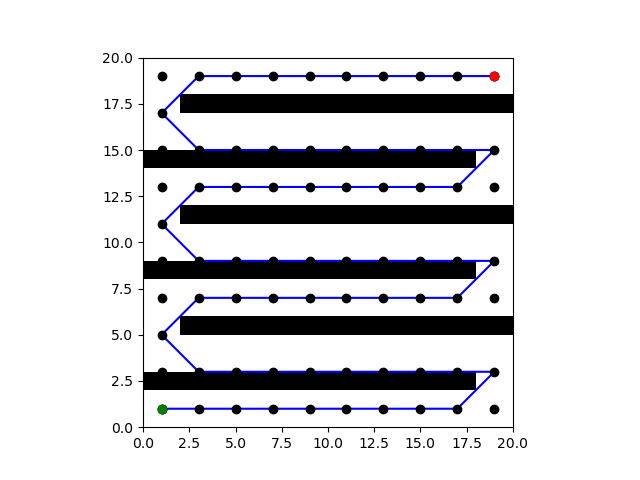
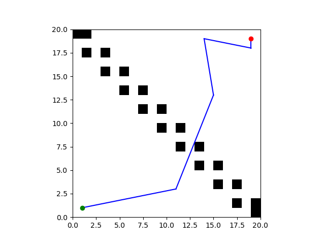

# Project 4: Planning

Replace this with your own writeup! Please place all figures and answer all questions in this directory.

**Q1.2** A* Shortest Path Figure: 

**Q2.1** RRT Path Figure: 

**Q2.2** RRT Path Figure: 

Planning time:
* with tree reuse: 58s
* without tree reuse: 130s

_(we don’t expect students to get the exact numbers but tree reuse should be faster in this question)_

Observation: Reusing the pre-constructed tree leads to more efficient planning.

When/why tree reuse doesn’t help: _Multiple acceptable answers, including but not limited to_
* RRT is sensitive to random seeds. RRT without tree reuse but with good luck can still beat RRT with tree reuse.
* The new goal is at a place where the previous RRT tree has bad coverage.

**Q3**

A* beats RRT Figure: 

A* is better than RRT because it is evidently much faster compared to RRT. A* is also better than RRT since it is guaranteed to find the optimal path to the goal, assuming its roadmap is sufficient.

RRT beats A* Figure: 

RRT is better than A* because it isn't limited by a roadmap like A* and thus can find paths to goals in more complex environments.

**Q5** A* heuristic design decisions: The heuristic sums up the absolute angular distances for all six elements, and then returns the non-negative heuristic by subtracting $\epsilon$ and taking the maximum with zero.
