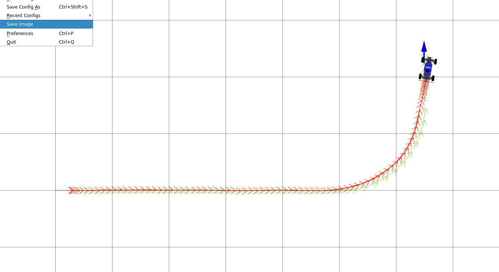

# Project 3: Control 

## Q2: PID Pure Pursuit Controller

### Q2.1 - Parameter Tuning and Path Tracking

**Wave Path:**

**Circle Path:**

**Left-Turn Path:**

### PID Parameter Tuning Explanation

For tuning the PID controller gains, I followed a systematic approach starting with proportional-only control before adding integral and derivative terms. I began by setting Ki=0 and Kd=0, then gradually increased Kp from 0.5 to test the car's responsiveness on the circle path. I found that Kp values around 1.5-2.0 provided good tracking but caused oscillations around the reference path, particularly on sharp turns. To dampen these oscillations, I introduced the derivative term, setting Kd to approximately 0.5-0.8 times Kp. This significantly smoothed the steering response and reduced weaving behavior. Finally, I added a small integral term (Ki=0.02-0.05) to eliminate steady-state offset errors that persisted on longer paths. The final gains (Kp=1.5, Ki=0.02, Kd=0.8) balanced responsiveness with stability across all test paths.

Testing across the three reference paths revealed different challenges for each. The circle path was easiest to tune for, requiring moderate proportional gain to maintain the constant curvature. The wave path introduced alternating left-right curves that stressed the derivative term—too little Kd caused oscillations at the inflection points, while too much made the controller sluggish in responding to direction changes. The left-turn path proved most challenging due to its sharp, sustained curvature combined with speed ramping. High Kp values caused overshoot at the turn entry, while low values resulted in cutting the corner. The integral term was particularly important here to compensate for the persistent cross-track error during the sustained turn. Overall, the tuned parameters needed to balance aggressive tracking (high Kp) with stability (adequate Kd) while minimizing steady-state drift (small Ki).

## Q4: Model-Predictive Controller (MPC)

### Q4.4 - Obstacle Avoidance in Slalom World

 

### MPC Parameter Tuning Explanation

Tuning the MPC parameters K, T, and distance_lookahead required balancing computational efficiency with prediction accuracy for obstacle avoidance. I started with K=20 and T=5 to explore the trade-off between sampling density and horizon length. Increasing K improves the controller's ability to find better steering angles but increases computational cost linearly—values above 60 showed diminishing returns as the steering angle resolution became fine enough to capture most trajectories. The time horizon T is critical for obstacle avoidance: too short (T<5) and the controller cannot see obstacles far enough ahead to plan around them smoothly, while too long (T>10) slows the control loop below the target 25 Hz. I settled on K=50-62 and T=7-8 as a compromise. The distance_lookahead parameter (1.0-1.5m) determines which reference point the controller targets, with larger values providing smoother paths but potentially missing tight waypoints.

The saw path (sharp zigzag pattern) is particularly difficult to track well because it requires rapid, large steering angle changes that violate the smooth trajectory assumptions of MPC. The controller samples constant steering angles over the horizon, which works well for gentle curves but poorly captures the aggressive direction reversals needed for a saw pattern. Each sharp turn in the saw path requires the car to simultaneously decelerate, execute near-maximum steering, and reaccelerate—but MPC's cost function only considers final state error and collisions, not the intermediate dynamics. Additionally, the K sampled trajectories may not include the exact aggressive maneuver needed, forcing the controller to choose suboptimal compromises. Increasing K helps somewhat by providing more steering options, but the fundamental issue is that the saw path's high-frequency content exceeds what the kinematic model can track smoothly at the given speed. Better performance would require either reducing the reference speed significantly, using a more sophisticated cost function that penalizes jerky steering, or implementing a higher-order controller that reasons about steering rate limits.