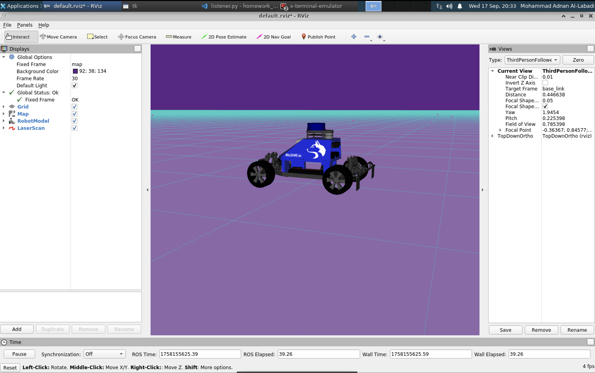

# Homework 1

### Define in your own words what a node, topic, publisher, and subscriber are and how they relate to each other

A node is basically a program or a device in a ROS system. Each node does some specific task, like reading sensor data or controlling a motor. Topics are the “channels” that let nodes talk to each other. A publisher is a node that sends messages out on a topic, and a subscriber is a node that listens to that topic and receives those messages. Together this makes a message-passing setup where publishers and subscribers don’t need to know about each other directly — they just share information through topics.

### What is the purpose of a launch file?

A launch file is used to start up multiple ROS nodes and set parameters all at once, instead of running each node manually. It makes it easier to manage bigger systems since you can bring up all the pieces you need with one command, and you can also configure things like remapping topics or setting arguments in the same place.

### Figures and Results

- **RViz Screenshot**: Include your RViz screenshot showing the car.  

- **Runtime Comparison**: Include your `runtime_comparison.png` figure for the different norm implementations.  

- **Figure 8 Plan**: Include the `locations.png` and `norms.png` figures for the plan `figure_8.txt`. Make sure the plots contain labelled axes and a title.  

- **Crown Plan**: Include the `locations.png` and `norms.png` figures for the plan `crown.txt`. Make sure the plots contain labelled axes and a title. 

