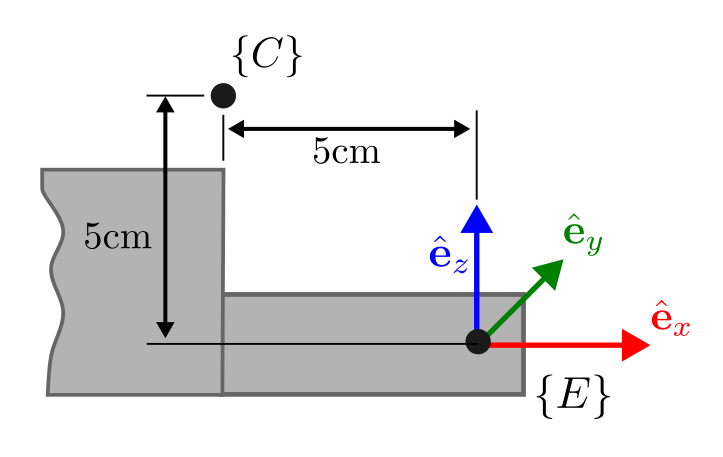

# Homework 2: Kinematics

Note: Some hints are provided in Hints_for_HW2.pdf. You may refer to them as needed.

## Car Kinematics
In this part of the assignment, you will work with the MuSHR platform. The goal is to implement the kinematics model of the MuSHR car in 2D.

**Q1**: Kinematics car model

**Q1.1 (20 points)** Kinematics model derivation
Let’s first review the kinematic model of the car and annotate the relevant lengths and angles (add figure).
First, let’s assume that there is no control, that the velocity is stable, and that the steering angle is <em>zero</em>. We can then write out the change in states:

<figure>

<figcaption align = "center"><b>Figure 1: Ackermann steering, or car-like steering</b></figcaption>
</figure>


$$
\begin{align*}
&\dot{x} = v \cos \theta \\
&\dot{y} = v \sin \theta \\
&\dot{\theta} = \omega
\end{align*}
$$
    
where $\omega$ is the angular velocity from the center of rotation to the center of the rear axle.
By the definition of angular velocity:
    
$$
\omega = \frac{v}{R} = \frac{v}{L} \tan \alpha
$$
    
Formally, the changes in states are:
    
$$
\begin{align*}
&\frac{\partial x}{\partial t} = v \cos \theta \\
&\frac{\partial y}{\partial t} = v \sin \theta \\
&\frac{\partial \theta}{\partial t} = \frac{v}{L} \tan \alpha
\end{align*}
$$

You will now derive the update to state $\mathbf{x} \_{t-1}$
after applying control $\mathbf{u}\_t$ 
to obtain $\mathbf{x}\_{t}$ by integrating over the time step. The update rule for $\theta\_{t-1}$ is done for you below:

$$
\begin{align*}
&\int_{\theta_{t-1}}^{\theta_{t}}d\theta =
\int_{t}^{t+\Delta t} \frac{v}{L} \tan \alpha dt \\
&\theta_{t}-\theta_{t-1} =\frac{v}{L} \tan \alpha \Delta t \\
&\theta_{t} = \theta_{t-1} + \frac{v}{L} \tan \alpha \Delta t \\
\end{align*}
$$

Please show your derivation process for $x_t$ and $y_t$ in your `/hw2_kinematics/writeup/README.md`. You may do this either by embedding Latex or taking a picture of your handwritten work (any illegible work will not be graded).

<details>
<summary>Rubric</summary>

* For <b>Q1.1</b>, 
    
    + 10 points for the correct derivation for $x_t$
    
    + 10 points for the correct derivation for $y_t$
</details>
<br>


**Q1.2 (25 points)** Implement the kinematic car equations in the `KinematicCarMotionModel.compute_changes` method (`src/kinematics/kinematic_model.py`). Note that this method is deterministic: given initial state $\mathbf{x}_{t-1}$ and control $\mathbf{u}_t$, it integrates the kinematic car equations and returns the changes between state $\mathbf{x}_{t-1}$ and new state $\mathbf{x}_t$.

Hint: Note that in our provided code, `states` has shape (M,3), and `control` has shape (M, 2). Think of it as we have M possible states for our car, and we have one command for every possible state (hence M commands in total). For example, the state represented by the first row of `states` will be applied with the control command represented by the first row of `control`. You will end up with an output array with shape (M, 3)  representing the change in states.

<details>
<summary>
What if the steering angle is 0?
</summary>

The update rule we derived divides by $\tan \alpha$, which means we’re dividing by 0 if the steering angle is 0. (Mathematically, the center of rotation is now infinitely far away.) Fortunately, the update rule becomes even simpler for this case: if there’s no steering angle, the car continues driving at angle $\theta$ with velocity $v$.

$$
\begin{align*}
&\theta_{t} = \theta_{t-1} \\
&x_{t} = x_{t-1} + v \cos \theta \Delta t\\
&y_{t} = y_{t-1} + v \sin \theta \Delta t
\end{align*}
$$

In your implementation, you should treat any steering angle where $| \alpha |$ is less than `alpha_threshold` as a zero steering angle.
</details>

You can verify your implementation on the provided test suite by running 
```
roscd car_kinematics/
python3 test/kinematic_model.py
``` 

Your code should pass all test cases starting with `test_compute_changes`.

After successfully implementing the kinematic car equations, we would want to propagate the changes (obtained using `KinematicCarMotionModel.compute_changes`) across states to generate the motion of our car.
<details>
<summary>Rubric</summary>

* For <b>Q1.2</b>, 25 points if all test cases starting with `test_compute_changes` pass.
</details>
<br>

**Q1.3 (20 points)**: Implement the simple deterministic motion model in the `KinematicCarMotionModel.apply_deterministic_motion_model` method (`src/kinematics/kinematic_model.py`).  Your implementation should also map the resulting $\theta$ component of the state to the interval $(-\pi, \pi]$. Angles that differ by a multiple of $2\pi$ radians are equivalent. For example, if the resulting $\theta$ component was $\theta = \frac{3\pi}{2}$, your implementation should return the equivalent angle $\theta = -\frac{\pi}{2}$.

After completing **Q1.3**, you should pass all test cases starting with `test_apply_deterministic`. 

<blockquote>
Remember the plot you generated for Project 1 comparing the <code>norm_python</code> and <code>norm_numpy</code> computation times? Your implementations for Q1.2, Q1.3, and subsequently Q1.4 should be <em>vectorized</em> using <a href="https://numpy.org/doc/stable/reference/arrays.indexing.html">NumPy indexing</a>, rather than iterating over each <b>particle</b> (representing the state) with Python for loops. (Both the “Basic Slicing and Indexing” and “Advanced Indexing” sections of that page are useful, but <a href="https://numpy.org/doc/stable/reference/arrays.indexing.html#boolean-array-indexing">Boolean array indexing</a> will be particularly useful when thresholding $\alpha$.)
</blockquote>
<br>
We've provided a script to visualize the motion of a car using the deterministic model.

```
rosrun car_kinematics make_rollout_plot
```

The staff solution produces the following plot after running the command above. Try to match these plots by correctly implementing the `apply_deterministic_motion_model` method. **Add this plot to your submission zip file for credit. Name it deterministic_rollouts.png.**

<figure class="figure mw-100 w-500px">
     
    <figcaption align = "center"><b>Figure 2: Rollouts generated using the deterministic motion model. The initial state (green arrow), final state (red arrow) and the intermediate states from integrating the deterministic model (red dots).</b></figcaption>
</figure>

<details>
<summary>Rubric</summary>

*  For <b>Q1.3</b>,
    
    + 10 points if all deterministic motion model test cases pass.
    
    + 10 points for matching the output in Figure 2.
</details>
<br>

**Q1.4 (15 points)**: 
Next, to make this simple kinematic model robust to various sources of modeling error, you’ll add noise in three steps. Noise is parameterized by $\sigma_v$ , $\sigma_\alpha$ (action noise) and $\sigma_x$ , $\sigma_y$ , $\sigma_\theta$ (model noise).

<ol type="1">
<li>

Given <em>nominal</em> controls $\mathbf{u}\_t = (v_t, \alpha_t)$, sample <em>noisy</em> controls $\hat{\mathbf{u}}\_t = (\hat{v}\_t, \hat{\alpha}\_t)$ where $\hat{v}\_t \sim \mathcal{N}(v_t, \sigma_v^2)$ and $\hat{\alpha}\_t \sim \mathcal{N}(\alpha_t, \sigma_\alpha^2)$.</li>
<li>

Integrate kinematic car equations with noisy controls $\Delta \hat{\mathbf{x}}\_t = \int\_{t-1}^t f(\mathbf{x}\_{t-1}, \hat{\mathbf{u}}\_t) dt$ (by calling the `compute_changes` method).</li>
<li>

Add model noise to the output $\Delta \mathbf{x}\_t \sim \mathcal{N}(\Delta \hat{\mathbf{x}}\_t, \mathrm{diag}(\sigma_x^2, \sigma_y^2, \sigma_\theta^2))$.
</ol>

Reuse the code written in `KinematicCarMotionModel.apply_deterministic_motion_model` method and implement a noisy motion model in the `KinematicCarMotionModel.apply_motion_model` method (`src/car_kinematics/kinematic_model.py`). There is an instance attribute corresponding to each noise parameter: `vel_std` corresponds to $\sigma_v$, `alpha_std` corresponds to $\sigma_\alpha$, etc. These instance attributes can be accessed with dot notation, e.g., `self.vel_std`.
After completing Q1.1, Q1.2, Q1.3, Q1.4, expect your code to pass all the test cases in `test/kinematic_model.py`.
<details>
<summary>Rubric</summary>

* For <b>Q1.4</b>, 15 points if all stochastic/noisy motion model test cases pass.
</details>
<br>

## [Optional for CS 4750, ECE 4770, MAE 4760 but required for CS 5750] Exploring the Motion Model Parameters (10 points)

The noise in this motion model is controlled by the parameters $\sigma_v$ , $\sigma_\alpha$  (action noise) and $\sigma_x$ , $\sigma_y$ , $\sigma_\theta$ (model noise). We’ve provided some initial values in `config/parameters.yaml`, but it’ll be up to you to tune them and make sure they’re reasonable. We’ve provided a script to visualize samples from your probabilistic motion model, under the current noise parameters in `config/parameters.yaml`.

```
rosrun car_kinematics make_motion_model_plot
```

The staff solution produces the following plots with our motion model that is tuned to match the physical MuSHR car. Try to match these plots by tuning your parameters.
<figure class="figure mw-100 w-500px">
     
    <figcaption><b>
        Figure 3: The initial state (green) and state from integrating the deterministic model (red). Particles (blue) after moving forward and slightly to the left.
        </b></figcaption>
</figure>

<figure class="figure mw-100 w-500px">
     
    <figcaption><b>
        Figure 4: Particles (blue) after moving forward and to the left. This banana-shaped curve is expected when noise is added to the system.
    </b></figcaption>
</figure>

> In `scripts/make_motion_model_plot`, look at the `example_cases` dictionary that generates these two plots. Each key of this dictionary is a tuple of nominal velocity, nominal steering angle, and duration to apply those nominal commands. Why does the motion model produce more particles within 10cm of the deterministic model prediction in Figure 3 than Figure 4?

The key to tuning is first understanding how each parameter affects the model.

>Tune your motion model parameters to match the staff parameters. To explain your tuning process, please save three versions of the figure with (3.0, 0.4, 0.5) that were generated by different parameters (`mm1.png`, `mm2.png`, `mm3.png`). In your writeup, explain what’s different between your plot and Figure 4 above, and how you’re changing the parameters in response to those differences. (Your last figure doesn’t need to match ours exactly.)

<details>
<summary>Rubric</summary>

* <b>[Optional (required for 5000 level students)]</b>, 10 points. Save correct figures and answer the questions in the README. 
</details>
<br>

## Arm Kinematics
### Overview
In this assignment, you will work with a 6 dof arm robot called [WidowX 250](https://www.trossenrobotics.com/widowx-250-robot-arm.aspx). 

<figure>
  
  <figcaption align = "center"><b> Figure 5: Picture of the WidowX 250. </b></figcaption>
</figure> 

The WidowX 250 can be modeled as a spatial 6R open chain. This open chain has six rotational joints: the first three joints function as a Cartesian positioning device, while the last three joints act as a ZYZ Euler angle-type wrist. The link frames are shown in the figure below. 

<figure>
  
    <figcaption align = "center"><b> Figure 6: Schematic of the WidowX 250, showing intermediate frames. </b></figcaption>
</figure> 

### Visualize your workspace for the WidowX arm

Feel free to run the launch file and have a look at your workspace.
```
# in terminal 1
$ roslaunch arm_kinematics fk_interactive.launch
```
You should see both `rviz` and `joint_state_publisher_gui` (might be behind rviz window) being launched. `joint_state_publisher_gui` allows you to use sliders to control all joint values. Feel free to play around with it.

<!-- + Base link: black
+ Shoulder link: blue
+ forearm link: green
+ gripper link: dark blue -->

On the left panel of Rviz, you will find a dropdown menu for [`TF`](http://wiki.ros.org/tf) package (shown below). This package allows you to keep track of multiple coordiante frames, and you will encounter this many times during the course. Take a look at the [website](http://wiki.ros.org/tf), and you might find many tools useful for debugging. 

As you can see in the image below, you can choose to visualize other frames. We have by default only enabled `base_link`, `ee_gripper_link`, and `camera_frame`.

<figure>
  
  <figcaption align = "center"><b> Figure 7: TF dropdown menu in Rviz </b></figcaption>
</figure>

**Q2.1 (5 points)**:
We provide a WidowX class that reads joint states and includes utilities for FK and Jacobians. In many tasks you need these quantities for a tool frame mounted on the end effector. Here, that tool is a camera.

The camera frame (shown below) is located with a fixed translation from the end-effector frame. The camera's view axis is the negative z-axis of the camera frame, which should point along the gripper ($+\hat{\mathbf{e}}\_x$). The camera's up axis is the positive y-axis of the camera frame, which should point along  ($+\hat{\mathbf{e}}\_z$). We have not drawn the frame $C$ on purpose - you should work out its orientation on your own. 

<figure>
  
  <figcaption align = "center"><b> Figure 8: Schematic of the camera frame relative to the end-effector frame. </b></figcaption>
</figure>


**Task.** Implement `WidowX.camera_offset()` in `src/arm_kinematics/widowx.py`. It must return a (4,4) homogeneous transform from the camera to the end-effector $\mathbf{T}\_C^E$ as a NumPy array.

Run the interactive demo again to sanity-check poses, then run the tests:
```
roscd arm_kinematics
python3 test/camera_frame.py
```

<details>
<summary>Rubric</summary>

+ 5 points: passes all of the tests in `test/camera_frame.py`
</details>

**Q2.2 (5 points)**:
We want the camera position to track a world-frame target. Use a proportional rule:
$$\mathbf{v}^G\_{des} = K\_p (\mathbf{p}^G\_{target} - \mathbf{p}^G\_{current}),$$
where $\mathbf{v}^G_{des}$ is the desired camera velocity in the world frame, $\mathbf{p}^G\_{target}$ is the target position in the world frame, $\mathbf{p}^G_{current}$ is the current camera position in the world frame, and $K\_p$ is a positive scalar gain.

**Task.** Implement the function `WidowX.vdes_ee_world_frame` in `src/arm_kinematics/widowx.py` to return $\mathbf{v}^G\_{des}$ as a `numpy` array of shape `(3,)`.

You can use:
* `self.forward_kinematics()` to get the current camera pose $\mathbf{T}^G_{C}$ as a 4x4 homogeneous transformation matrix.
* `self.camera_pos_jacob_world_frame()` to get the position Jacobian of the camera in the world frame $\mathbf{J}^G_{C}$ as a 3x6 matrix.
* `self.Kp` to get the proportional gain.

Your implementation should pass the provided tests.
```
roscd arm_kinematics
python3 test/vdes_ee_world_frame.py
```
<details>
<summary>Rubric</summary>

+ 5 points: passes all of the tests in `test/vdes_ee_world_frame.py`
</details>

**Q2.3 (5 points)**: We can now use the desired camera velocity to compute a joint velocity command $\dot{\mathbf{q}}_{des}$ which (at most configurations) will move the camera along the desired trajectory.

**Task.** Implement the function `WidowX.qdot_tracking` in `src/arm_kinematics/widowx.py` to return $\dot{\mathbf{q}}\_{des}$ as a `numpy` array of shape `(6,)`. $\dot{\mathbf{q}}\_{des}$ should minimize the least-squares error between the actual camera velocity $\mathbf{v}^G\_E$ and the desired camera velocity $\mathbf{v}^G\_{des}$.

Your implementation should pass all three tests.
```
roscd arm_kinematics
python3 test/qdot_tracking.py
```
<details>
<summary>Rubric</summary>

+ 5 points: passes all of the tests in `test/camera_frame.py`
</details>

**Q2.4 (5 points)**: We now have all ingredients needed to implement a simple kinematic simulation, which we have provided in a node `arm_kinematics/nodes/kinematic_sim`. 

You can launch the simulation by running:
```
roscd arm_kinematics
roslaunch arm_kinematics tracking.launch Kp:=1.0 period:=2.0
```

This will launch an `rviz` window, and now will use your `WidowX` class to compute the forward kinematics and joint velocities. You should see the arm moving to track a target position moving in a figure-8 pattern. 

**Task.** Answer the following two questions in your `/hw2_kinematics/writeup/README.md`.

1. You will notice the end-effector orientation does not match the target orientation. Briefly describe why this is the case. How could we modify the controller to also track the target orientation?

2. Describe the behavior of the arm for different values of `Kp`. In particular, describe what happens when `Kp` is very small (e.g., `Kp=0.1`) and when `Kp` is large (e.g., `Kp=50.0`). 

*Note:* If you set `Kp` too large, the arm may start to oscillate wildly. Don't worry - this is expected behavior - and we will discuss how and why during the control module.
<details>
<summary>Rubric</summary>

+ 2.5 points: Discussion of orientation tracking and how to modify the controller.

+ 2.5 points: Discussion of behavior for different values of `Kp`.
</details>

