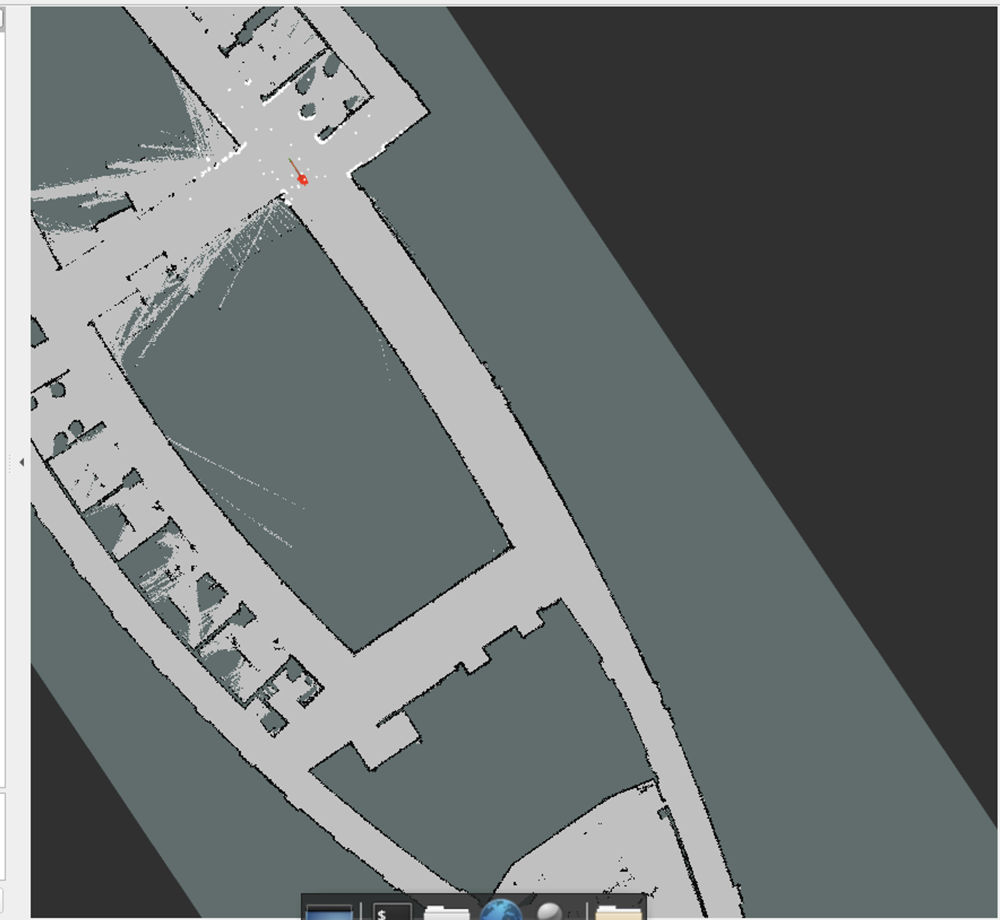

# Homework 3 Writeup  
State Estimation for WidowX 250 Arm and MuSHR Car

## Section 1  

### Q1.4 Tuning Explanation

The goal of tuning the particle filter was to reduce the mean position error as the tracker followed the cylinder. Initially, the untuned filter was inefficient, producing a highly spread out particle cloud and reacting slowly to the detected position. This behavior indicated that the motion model noise and the initial covariance were overwhelming the simple dynamics of the cylinder.

The tuning process began with adjusting the number of particles. Increasing the count reduced random variance and smoothed the estimate, but excessive numbers decreased the update rate. A value was selected to maintain stability without sacrificing performance.

Next, the constant velocity and motion noise used in the prediction step were optimized. Since the particle filter itself drives the movement, the constant velocity was kept small to prevent estimation drift. The motion noise standard deviation had the greatest impact. High noise scattered the particles widely, making the filter heavily dependent on the observation step. Decreasing this noise yielded more coherent predictions that better aligned with the true motion. This parameter was carefully adjusted until the filter reacted quickly to observations while preserving enough particle diversity.

The initial covariance also required reduction. The default large covariance spread the initialization across nearly the entire image, which caused very slow initial convergence. Reducing the covariance allowed the particles to begin closer to the expected cylinder location, resulting in rapid convergence toward the first observation.

Each parameter choice was evaluated using a tracking demonstration and quantitative analysis of the position error plot. We monitored how fast the filter locked onto the cylinder, the stability of the estimated trajectory, and the resulting running mean error. After testing multiple configurations, a final set of tuned parameters was achieved, leading to smooth, stable tracking and a consistently low mean error throughout the sequence.

**Position error**  

## Section 2  

### Q2.1 RVIZ Tracking Output

 The screenshot below shows the car at a non default location with the inferred pose and particles displayed.

**RVIZ tracking**  

---
### Q2.3 Particle Cloud Shape Explanations

This part of the assignment examined the particle cloud behavior in two specific map locations. The shape of the cloud reflects the level of directional uncertainty and how well the environment constrains the car’s pose.

#### Location One  
Car facing straight down a hallway

At this location the particle cloud formed a long narrow band aligned with the hallway direction. The structure of a corridor provides strong constraints across the width of the hallway because the walls restrict lateral movement. However, the corridor gives very little information about the car’s position along its length. Many different forward positions produce nearly identical laser readings, which increases uncertainty in that direction. The result is a particle cloud that is tightly concentrated laterally but elongated forward and backward along the corridor. We also have more particle on the right of the car since its a bit titled that way.

**Hallway Particle Cloud Screenshot**  

#### Location Two  
Car at an intersection

At the intersection the particle cloud became much more spreadout and roughly symmetric around the car from all the different corners and places. Intersections provide distinctive geometric features in several directions. The laser readings contain information from open areas, multiple walls, and angled structures, which reduces positional ambiguity. Because the environment at the intersection strongly constrains the robot’s position, the filter collapses into a tighter and more localized distribution.

**Intersection Particle Cloud Screenshot**  

