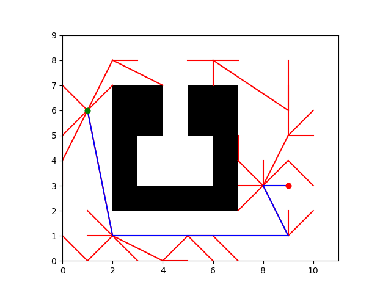

# Homework 4: Planning

## Overview 
In this project, you will implement both A* and RRT planning algorithms for the MuSHR car and the Widowx250 arm robot. While this sounds intimidating, you will soon realize that planning algorithms can be easily generalized to different platforms.

Note: Some hints are provided in `hw4_hints.pdf`. You may refer to them as needed.


## Section 1: A* and RRT (65 points for Undergrads, 75 points for Grads)

### Code Overview
The first step of motion planning is to define the problem space (`planning/src/planning/problems.py`). This section only considers `PlanarProblems`: `R2Problem`. The `R2Problem` configuration space only considers the x- and y- positions. The `PlanarProblem` class implements shared functionality, such as collision-checking. The specific problems implement their own distance and steering functions to connect two configurations. After defining these classes, the rest of your planning algorithm can abstract away these particulars of the configuration space. (To solve a new type of problem, just implement a corresponding problem class.)

The Roadmap class contains many useful methods and fields. Three fields are particularly important: `graph`, `vertices`, and `weighted_edges`. `Roadmap.graph` is a [NetworkX](https://networkx.org/) graph, either `undirected` or `directed` depending on the problem type. The starter code already handles interacting with this object. Nodes in the NetworkX graph have integer labels. These are indices into `Roadmap.vertices`, a NumPy array of configurations corresponding to each node in the graph. `Roadmap.weighted_edges` is a NumPy array of edges and edge weights; each row `(u, v, w)` describes an edge where `u` and `v` are the same integer-labeled nodes and `w` is the weight (length for R2) of the edge between them.

### Q1. Searching on R2 Problems using A* (20 points)
In this problem, we will write the A* planning algorithm for a roadmap. Roadmaps are already provided - to visualize a simple roadmap, run the following command:

```
roscd planning
python3 scripts/roadmap --saveto "test/share/map1.pkl" -m test/share/map1.txt --show-edges
```

<figure>
  
 <figcaption> Figure 1: A simple roadmap </figcaption>
</figure> 
<br/><br/>

The A* algorithm expands nodes in order of their f-value $f(n) = g(n) + h(n)$, where $g(n)$ is the estimated cost-to-come to the node $n$ and $h(n)$ is the estimated cost-to-go from the node $n$ to the goal. For this problem, we will use the Euclidean distance for both cost-to-come and cost-to-go.

**Q1.1** Implement the `compute_distance` function for `R2Problem` class in `planning/src/planning/problems.py`. Your implementation should compute the Euclidean distance between corresponding elements of two arrays of states in R2 space. Note that `cost_to_go` makes use of `compute_distance` to compute the heuristic cost.

You can verify your implementation on the provided test suites by running `python3 test/problems.py`. 

<details>
<summary>Rubric</summary>

5 points for passing test suites in `test/problems.py`
</details>

**Q1.2:** Implement the main A* logic in `planning/src/planning/search.py`. For each neighbor, check if it hasn't been expanded yet, and if so, compute the cost-to-come of the neighbor node via the current node (cost-to-come for the current node, plus the length of the edge to the neighbor). Next, compute the f-value of the neighbor node (cost-to-come plus heuristic). Insert a `QueueEntry` with this information into the [priority queue](https://en.wikipedia.org/wiki/Priority_queue) (You can learn more about our provided priority queue in `search.py` line 15-24). Then, implement `extract_path` to follow the parent pointers from the goal to the start; this function is called by A* after the goal has been expanded to finally return the sequence of nodes.

You can verify your implementation on the provided test suites by running `python3 test/astar.py`. This file contains tests for both `R2Problem` and `SE2Problem` (which we will implement in the next section). Make sure your implementation is passing the `test_astar_r2problem` suites (it is fine to be failing `test_astar_se2problem` suites right now).

You should now be able to run an A* planner from the start to the goal! The following command specifies that it is an `R2Problem`, planning from the start of (1, 6) to the goal of (9, 3). Your plot should match the reference plot below.

```
python3 scripts/run_astar -m test/share/map1.txt -n 25 -r 3.0 --show-edges r2 -s 1 6 -g 9 3
```

<figure>
  
  <figcaption> Figure 2: A* path in blue on map1.txt, from (1, 6) in green to (9, 3) in red. </figcaption>
</figure> 
<br/><br/>

Compute the shortest path on map2.txt between (252, 115) and (350, 350) with the following command: 

```
python3 scripts/run_astar -m test/share/map2.txt -n 600 -r 100 r2 -s 252 115 -g 350 350 
```

Include the shortest path figure in your submission in `hw4_planning/writeup/`.

<details>
<summary>Rubric</summary>

10 points for passing `test_astar_r2problem` suites in `test/astar.py` <br>
5 points for correct shortest path figure corresponding to problem on map2.txt
</details>

### Q2. Searching on R2 Problems using RRT (30 points for Undergrads, 40 points for Grads)

You will be implementing a Rapidly-Exploring Random Tree (RRT) for the same 2D world. For more details on the algorithm, refer to the reading material on the course website. The main algorithms are to be implemented in `RRTPlanner` class in `planning/src/planning/search.py`. A class called `RRTTree` is implemented in `planning/src/planning/RRTTree.py`.

**Q2.1** Implement the main RRT logic in `planning/src/planning/search.py`.  First, implement the `extend` function in class `RRTPlanner`. Then, complete the `Plan` function. Specifically, you will need to sample a random point and add vertex/edge accordingly.  

You should now be able to run a RRT planner from the start to the goal! The following command specifies that it is an R2Problem, planning from the start of (1, 6) to the goal of (9, 3). Your plot should match the reference plot below.

```
roscd planning
python3 scripts/run_rrt -m test/share/map1.txt -s 1 6 -g 9 3 --show-tree
```
> The --show-tree flag allows you to visualize the growing of your tree in real time. You can also specify how many random samples you want to draw at each iteration by specifying `-size n`, where n is the number of samples. You can also specify step size eta using the flag `-e`.

 <figure>
  
  <figcaption>Figure 3: RRT path in blue on map1.txt, from (1, 6) in green to (9, 3) in red.</figcaption>
</figure> 
<br/><br/>

Your implementation is expected to pass `python3 test/rrt.py`. 

Run RRT on map2.txt to find the path between (252, 115) and (350, 250) with the following command: 

```
python3 scripts/run_rrt -m test/share/map2.txt -s 252 115 -g 350 250 --show-tree -size 100 
```

Include the figure visualizing the RRT path in your submission in `hw4_planning/writeup/`.

<details>
<summary>Rubric</summary>

10 points for passing test suites in `test/rrt.py` <br>
5 points for correct RRT path figure corresponding to problem on map2.txt
</details>

**Q2.2**
In many robotic applications, robots need to replan frequently as the environment or goal changes. Instead of rebuilding the tree from scratch each time, we can reuse the previously constructed RRT tree as a starting point and extend it toward a new goal. This can significantly reduce planning time when the new goal is in a similar region of the configuration space.

Implement the ability to save and load RRT trees in the `RRTTree` class in `planning/src/planning/RRTTree.py`. Specifically:

- Implement `SaveTree(filename)` to save the tree to a file;
- Implement `LoadTree(filename)` to load a tree from a file.

To test your implementation, first run RRT on map2.txt as before, but with `--save-tree [tree_path]` to save the constructed tree this time (replace `[tree_path]` with the actual path you want to save the tree to):

```bash
python3 scripts/run_rrt -m test/share/map2.txt -s 252 115 -g 350 250 --show-tree -size 100  --save-tree [tree_path]
```

Then reuse this tree in RRT planning for a different goal at (350, 250) (replace `[tree_path]` with the actual path you saved the tree to):

```bash
python3 scripts/run_rrt -m test/share/map2.txt -s 252 115 -g 380 360 --show-tree -size 100  --reuse-tree [tree_path]
```

Include the plot visualizing the RRT path in your submission. Please also record the planning time output from the terminal for comparison.

Your implementation is expected to pass `python3 test/rrt_reuse.py`. 

What if we run RRT from scratch for the same problem? Run the following command to plan with RRT without reusing the saved tree. Record the planning time and compare with the previous run.  
```bash
python3 scripts/run_rrt -m test/share/map2.txt -s 252 115 -g 380 360 --show-tree -size 100
```

In your `hw4_planning/writeup/README.md`, include the following:

* The plot of the RRT path on map2.txt **with tree reuse**.
* The planning time for RRT with and without reusing the saved tree.
* Your answer to the following question: Does reusing the tree make the replanning more efficient in this example? If not, why? If it does, could you imagine when it doesn't? (Feel free to try different goals and see how the RRT planner behaves.)

<details>
<summary>Hint</summary>

Think about what information / data structures you need to save to reconstruct an RRT tree.  
There are multiple options you could choose to save Python objects, such as [`pickle`](https://docs.python.org/3/library/pickle.html) and [`json`](https://docs.python.org/3/library/json.html#module-json).

</details>

<details>
<summary>Rubric</summary>

5 points for passing the test suites in `test/rrt_reuse.py`.  <br>
5 points for correct plot visualizing the RRT path on map2.txt with tree reuse.  <br>
5 points for planning time report, as well as observation and reasoning on planning efficiency with tree reuse.

</details>


**Q2.3 (For graduate students only)** RRT planner's output is usually not optimal, and some postprocessing is required. Implement the `ShortenPath()` function in `planning/src/planning/search.py`. 

Once you finish, add flag `--shortcut` to visualize new plan. Shortcuts will be shown in color green.

```
python3 scripts/run_rrt -m test/share/map1.txt -s 1 6 -g 9 3 --show-tree --shortcut
```
Your plot should match the reference plot below.

 <figure>
  
  <figcaption>Figure 4: RRT path in blue on map1.txt, shortcut in green from (1, 6) in green to (8, 3) in red.</figcaption>
</figure> 

Your implementation is expected to pass `python3 test/rrt_shortcut.py`. 

<details>
<summary>Rubric</summary>

10 points to grad students for passing test suites in `test/rrt_shortcut.py`. Glory to undergrads. <br>
</details>

### Q3. Tradeoffs between A* and RRT (15 points)
Now that you have implemented A* and RRT, you will explore their tradeoffs. You will be constructing maps where A* prevails over RRT and where RRT prevails over A*. Under `test/share` are two text files that you will be modifying for this question, `astar_beats_rrt_map.txt` and `rrt_beats_astar_map.txt`. 

Each file is currently a 20 by 20 grid of 1s, representing open space. By changing a 1 to a 0, you can create a wall in the map. The coordinate system of the grid is at the upper left corner such that the x-axis increases to the right and the y-axis increases downwards. 

To manually test a map using A*, use

```
python3 scripts/run_astar -m test/share/<map_name>.txt -n 100 -r 3.0 --sampler lattice r2 -s 1 1 -g 19 19
```

and verify your plot matches the reference plot below.
<figure>
  
  <figcaption>Figure 5: A* path in blue from (1, 1) in green to (19, 19) in red.</figcaption>
</figure> 
<br/><br/>

To manually test a map using RRT, use

```
python3 scripts/run_rrt -m test/share/<map_name>.txt -s 1 1 -g 19 19 -size 100
```

and verify your plot matches the reference plot below.

<figure>
  
  <figcaption>Figure 6: RRT path in blue, from (1, 6) in green to (9, 3) in red.</figcaption>
</figure> 
<br/><br/>

When you are done, run the `python3 test/tradeoff.py` to test your maps.

Include the path created by A* in the `astar_beats_rrt_map.txt` map and the path created by RRT in the `rrt_beats_astar_map.txt` map in your submission under `hw4_planning/writeup/`. Then explain the tradeoffs between A* and RRT in `hw4_planning/writeup/README.md`.

<details>
<summary>Hint</summary>

To make the paths more predictable for A*, this question uses a lattice sampler which constructs the roadmap as a lattice. Previous questions use a Halton sampler which has a better spread of roadmap points. Think about how you can use this detail to construct your maps.
</details>

<details>
<summary>Rubric</summary>

5 points for passing test suites in `test/tradeoff.py` <br>
5 points for reasonable A* and RRT paths <br>
5 points for correct explanation of tradeoffs
</details>


## Section 2: Planning for Car (5 points)

### Q4. Searching on SE(2) using AStar (5 points)

So far, we’ve been solving `R2Problems`. But since the MuSHR cars have an orientation, the problems we need to solve are `SE2Problems`, which concerns about both x, y position, and orientation. Thus, your NetworkX graph will have directed edges. The [Dubins path](https://en.wikipedia.org/wiki/Dubins_path) connects two configurations, with a maximum specified curvature<sup>[1](#1)</sup>. Since the Dubins path is directed, the graph will be directed. As a result, more vertices are generally needed for the graph to be connected.

Implement the `compute_distance` function for `SE2Problem` in `planning/src/planning/problems.py` (remember to make use of `dubins.path_length()`). Your implementation should compute the cost estimate between two states in SE2 space. Note that `cost_to_go` uses `compute_distance` to compute the heuristic cost. 

You can verify your implementation on the provided test suites by running `python3 test/astar.py`. Your implementation should pass the `test_astar_se2problem` suites. 

To visualize planned path with Dubins path as edges, run
```
python3 scripts/run_astar -m test/share/map1.txt -n 40 -r 4 --show-edges se2 -s 1 6 0 -g 9 3 45 -c 3
```
Your plot should match the reference plot below.

<figure>
  
  <figcaption>Figure 7: AStar SE(2) path in blue on map1.txt, from (1, 6) in green to (9, 3) in red.</figcaption>
</figure> 
<br/><br/>

After you have successfully implemented the `compute_distance` function for `SE2Problem`, you should be able to use A* to plan the path for MuSHR car in the maze roadmap.

```
roslaunch car_planning planner_sim.launch map:='$(find cs4750)/maps/maze_0.yaml' num_vertices:=1000 connection_radius:=10 curvature:=1 
```
Then, in rviz, select "2D Nav Goal" and click/drag on the map.

<figure>
  
  <figcaption>Figure 8: Planned path in red.</figcaption>
</figure> 
<br/><br/>

<details>
<summary>Rubric</summary>

5 points for passing `test_astar_se2problem` suites in `test/astar.py` <br>
</details>

## Section 3: Planning for Widowx 250 Arm (35 points)

Open a terminal and run 
```
roslaunch widowx250_moveit_config widowx_simple_env.launch use_rviz:=true
```
You should see a widowx250 arm is placed next to a table. In this section, you will plan various paths for widowx250 while avoiding hitting the table and floor.

 <figure>
  
  <figcaption>Figure 9: Planning Environment for arm. </figcaption>
</figure> 
<br/><br/>

At this point, you have successfully implemented both RRT and A* planning algorithms. As you may know, these algorithms are not restricted to any platforms. In fact, they are widely use in robot arms as well. Robot arms are different from a car in many ways. Most importantly, we are working with a higher dimensional configuration space. Hence, the definition of distance and heuristics will be different from the car example. 

### Q5: Design heuristic function for A* for planning with Widowx 250 Arm (15 points)
In this assignment, let's interpret the distance between two robot arm configurations as changes in joint angles. Note that the distance between two joint states has been defined as the sum of absolute change in each joint angle (`JointSpace.compute_distance` in `planning/src/planning/problems.py`). Come up with your own admissible heuristic function to the target configuration in `JointSpace.cost_to_go` (`planning/src/planning/problems.py`). A heuristic is said to be admissible if it never overestimates the cost of reaching the goal (and is non-negative). As in previous question, we have provided you a roadmap to search in. Note that the joints in this robot arm are assumed to have bidirectional motion, i.e., they can rotate in either direction. Make sure to take into account warping around 2*pi for joint angles in your implementation. 

To visualize your A* planning algorithm
```
# In terminal 1, run
roslaunch widowx250_moveit_config widowx_simple_env.launch use_rviz:=true

# In terminal 2, run
rosrun arm_planning astar_planning -s 0 0 0 0 0 0 -g -2.3472 0.9303 -0.8133 1.6733 0.8535 -1.7264
```

Once a path is found, waypoints of the planned path will be displayed in Rviz. Feel free to use the `Trajectory Slider` in the left bottom pannel of Rviz to visualize your plan sequentially (If the slider did not load the latest trajectory, close it and restart by going to `Panels` (top left of RViz window) -> `Motion Planning - Trajectory Slider`).

After successfully implementing the heuristic function, you should pass all tests when you run

```
# In terminal 1, run
roslaunch widowx250_moveit_config widowx_simple_env.launch use_rviz:=true

# In terminal 2, run
python3 arm_planning/test/problems_arm.py
```
In `hw4_planning/writeup/README.md`, briefly tell us how did you design your heuristic function.

<details>
<summary>Issues with non-admissible heuristic?</summary>

An admissible heuristic must be less than or equal to the true cost of reaching a node. If you expect your heuristic to be equal to the true cost, check the test failure and verify that your heuristic isn't barely over the true cost due to a floating point error. If this is the case, you should subtract your heuristic by a very small epsilon, `1e-8`.
</details>

<details>
<summary>Rubric</summary>

10 points for successfully passing all test suites in `arm_planning/test/problems_arm.py`.<br>
5 points for description of heuristic function design.
</details>

### Q6: Distance functions for RRT (20 points)
Let's say we have a robotic arm that executes motion in each joint at different joint velocities, which we represent by $v$. You are asked to design a distance function for RRT that aims to find the path which can be executed in minimum time given these different velocities. Note that the time spent in executing the motion from source state $q1$ to target state $q2$ is the maximum of absolute change in each joint angle divided by the joint velocity: 

$$ \text{Time spent in executing motion from q1 to q2} = \max_{i=1\ \text{to}\ 6} \text{abs}((q1[i] - q2[i])/v[i]) $$ 

Note that we haven't shown warping around 2\*pi in the above equation for concision. Make sure to take that into account in your implementation. Suppose that these joint velocities are `1.0`, `1.2`, `0.8`, `0.75`, `1.05`, and `0.9` for joints `waist`,`shoulder`, `elbow`, `forearm_roll`, `wrist_pitch`, and `wrist_roll` respectively. Design a distance function (`JointSpace.compute_distance_rrt()`) in `planning/src/planning/problems.py` such that RRT uses the time spent in executing the motion from source state to target state as the cost estimate these two states. 

After implementing your cost function, test it and see what path it will find!

```
# In terminal 1, run
roslaunch widowx250_moveit_config widowx_simple_env.launch use_rviz:=true

# In terminal 2, run
rosrun arm_planning rrt_planning -s 0 0 0 0 0 0 -g -2.3472 0.9303 -0.8133 1.6733 0.8535 -1.7264 -e 0.5 
# different step size, eta
rosrun arm_planning rrt_planning -s 0 0 0 0 0 0 -g -2.3472 0.9303 -0.8133 1.6733 0.8535 -1.7264 -e 0.8 
```

After successfully implementing the heuristic function, you should pass all tests when you run

```
# In terminal 1, run
roslaunch widowx250_moveit_config widowx_simple_env.launch use_rviz:=true

# In terminal 2, run
python3 arm_planning/test/custom_distance_rrt.py
```

<details>
<summary>Rubric</summary>

20 points for successfully passing all test suites in `arm_planning/test/custom_distance_rrt.py`.
</details>


<a name="1">1</a>  The curvature is the inverse of the arc radius, so it has units of meters-1. Therefore, a maximum curvature corresponds to a minimum turning radius.


### Submission 
zip hw4_planning folder and submit to Gradescope. You must zip your folders along with the top folder as the wrapper folder (hw4_planning). IMPORTANT: Make sure you remove `-main` from the name of the folder before zipping (if present).
```
$ zip -r <name of zip> hw4_planning/
```

#### How to add figures to your Markdown submission
Please answer all the write-up questions in the file:
hw4_planning/writeup/README.md. To include figures in your submission, save your image files in the 'writeup' folder, then add the images to your README using the following Markdown format: ``.

```
hw4_planning/
├── .../           
├── writeup/
│   ├── README.md     # Your written answers
│   ├── Q1_2_shortest_path.png
│   ├── Q2_1_RRT.png
│   ├── Q2_2_RRT_reuse.png
│   ├── astar_beats_rrt.png
│   ├── rrt_beats_astar.png
```