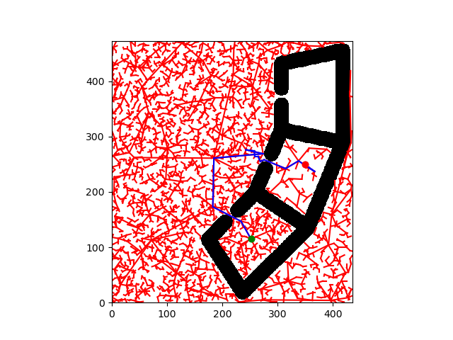
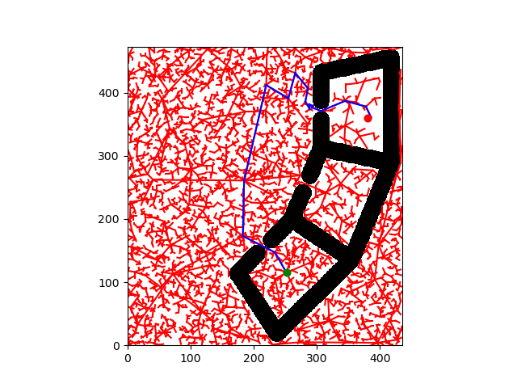
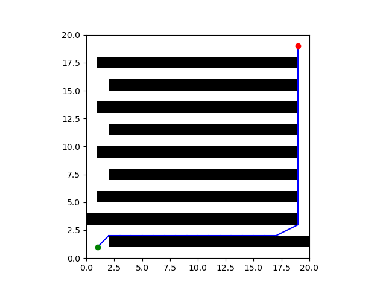

# Question 1.2: A* (Plot)

A* on `map2.txt`:

**Vertices:** 600  
**Edges:** 19907  
**Path:** [600, 513, 149, 16, 441, 540, 304, 601]  
**Path length:** 362.89  
**Planning time:** 2.60s  
**Edges evaluated:** 23016

**Short explanation:**  
A* expands outward in a structured way and produces a relatively smooth, near-optimal path. The heuristic kept the search directed toward the goal.

---

# Question 2.1: RRT (Plot)

RRT exploration tree:

**Summary:**  
RRT quickly spread through free space before drifting toward the goal. Because it's sampling-based, the path isn't necessarily optimal, but it reaches the goal efficiently.

---

# Question 2.2: RRT Reuse (Plot + Writeup)

Reused RRT tree:

## WITHOUT REUSE:

**Planning complete!**

**Plan:** [[252. 115.] [234. 147.] [183. 173.] [185. 261.] [274. 269.] [243. 276.] [258. 274.] [259. 264.] [265. 264.] [267. 259.] [269. 255.] [276. 258.] [315. 242.] [316. 243.] [338. 256.] [367. 237.] [357. 244.] [350. 250.]]  
**Cost:** 471.00  
**Planning Time:** 101s  
**Sampled Collisions:** 1126

## WITH REUSE (Different goal):

**Planning complete!**

**Plan:** [[252. 115.] [234. 147.] [183. 173.] [185. 261.] [220. 412.] [255. 391.] [266. 431.] [286. 407.] [282. 386.] [289. 374.] [289. 381.] [294. 379.] [292. 377.] [294. 376.] [307. 371.] [345. 387.] [378. 378.] [386. 361.] [380. 360.]]  
**Cost:** 610.00  
**Planning Time:** 97s  
**Sampled Collisions:** 44

**Writeup:**  
Reusing the tree significantly reduced planning time (44 compared to 1126 collisions and 97s instead of 101s) because much of the space was already explored. The second run mainly needed to connect the existing tree to the goal rather than starting from scratch.

---

# Question 3: A* / RRT Tradeoff (Plots + Writeup)

## 1. astar_beats_rrt_map

### A* Performance:

**Vertices:** 82  
**Edges:** 251  
**Path:** [82, 11, 22, 33, 44, 54, 64, 71, 75, 76, 77, 78, 79, 80, 83]
**Path length:** 32.97  
**Planning time:** 0.031s  
**Edges evaluated:** 274

.png)

### RRT Performance:

**Planning complete!**

**Plan:** [[ 1.  1.]
 [14. 13.]
 [ 6.  9.]
 [ 8. 12.]
 [ 9. 13.]
 [ 9. 14.]
 [ 9. 15.]
 [ 7. 17.]
 [ 8. 17.]
 [ 9. 17.]
 [10. 17.]
 [11. 17.]
 [12. 17.]
 [13. 17.]
 [14. 17.]
 [15. 17.]
 [17. 18.]
 [18. 19.]
 [19. 19.]]
**Cost:** 45.00  
**Planning Time:** 10s  
**Sampled Collisions:** 182

.png)

## 2. rrt_beats_astar_map

### A* Performance:

A* times out (no figure)

### RRT Performance:

**Planning complete!**

**Plan:** [[1. 1.] [2. 2.] [3. 2.] [4. 2.] [5. 2.] [6. 2.] [7. 2.] [8. 2.] [9. 2.] [10. 2.] [11. 2.] [12. 2.] [13. 2.] [14. 2.] [15. 2.] [16. 2.] [17. 2.] [19. 3.] [19. 9.] [19. 16.] [19. 18.] [19. 19.]]  
**Cost:** 34.00  
**Planning Time:** 1s  
**Sampled Collisions:** 3012

**Writeup:**  
A* provides a more direct and often optimal path but can be slower in large spaces with obstacles since it systematically expands. RRT is much faster in high-dimensional or cluttered environments but doesn't guarantee an optimal path. A* is best when path quality matters; RRT is best when speed and coverage matter.

---

# Question 5: A* Heuristic Function (Writeup)

I designed the heuristic using the joint-space distance between two configurations. Since the assignment defines cost as the sum of absolute joint differences, using the same metric as the heuristic keeps it admissible. It always underestimates or equals the real cost and stays non-negative. I also subtract a small epsilon to avoid floating-point cases where it might slightly exceed the true cost. This helped A* converge faster while passing all tests.