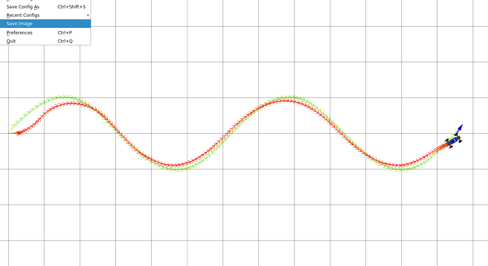
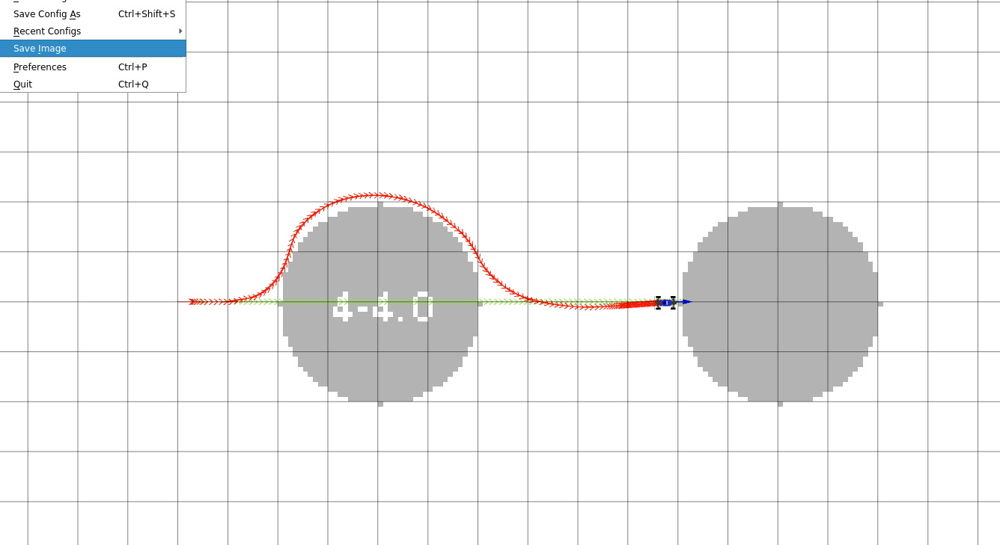

# Project 3 Control 

## Q2 PID Pure Pursuit Controller

### Q2.1 Parameter Tuning and Path Tracking

**Wave Path**

**Circle Path**

**Left Turn Path**

### PID Parameter Tuning Explanation

To tune the PID controller, I started by experimenting with the gains to understand how each term affected the car’s behavior rather than relying directly on the provided parameters. I first set the integral and derivative gains to zero and increased the proportional gain from around 0.5 while testing on the circle path. As Kp increased, the car followed the path more tightly, but higher values quickly introduced oscillations, especially on curved sections.

Once I found a reasonable proportional gain around 0.8, I added a derivative term to reduce the oscillations. Setting Kd to about 0.5 helped smooth the steering response and reduced side to side weaving without making the controller feel too slow. After that, I introduced a small integral term to deal with steady state cross track error that appeared on longer or sustained turns. Larger integral values caused slow oscillations, so I kept Ki relatively small at 0.05.

The different paths emphasized different aspects of the controller. The circle path was the easiest to track and mainly helped with tuning Kp. The wave path, with its frequent direction changes, made the effect of the derivative term very noticeable. The left turn path was the hardest because of its sharp and sustained curvature, where the integral term helped reduce consistent offset from the reference path. Using Kp = 0.802, Ki = 0.05, and Kd = 0.5 gave stable and consistent tracking across all three paths.

## Q4 Model Predictive Controller MPC

### Q4.4 Obstacle Avoidance in Slalom World

### MPC Parameter Tuning Explanation

For the MPC controller, I tuned the parameters by balancing how well the car could plan ahead with how fast the controller could run in real time. I started with smaller values of K and T to see how the controller behaved, then gradually increased them. Increasing K improved the quality of the sampled steering trajectories, but values above around 60 did not noticeably improve performance while increasing computation time. I ended up using K = 62 as a good balance.

The prediction horizon T had a large impact on obstacle avoidance. When T was too small, the car reacted to obstacles too late and made sharp corrections. When T was too large, the controller became too slow to run at the desired rate. A horizon of T = 8 allowed the car to see obstacles early enough while still maintaining stable performance. The distance lookahead parameter controls which point on the reference path the controller tries to reach. Smaller values made the car more aggressive, while larger values smoothed the motion but reduced accuracy. A lookahead distance of 1.2 m worked best in the slalom environment.

The saw path was especially difficult for MPC because it requires very fast and aggressive steering changes. Since the controller samples trajectories with constant steering over the horizon, it struggles to represent the sharp back and forth turns of the saw pattern. Increasing K helped slightly, but the main limitation comes from the model and assumptions of the controller rather than the specific parameter values.
